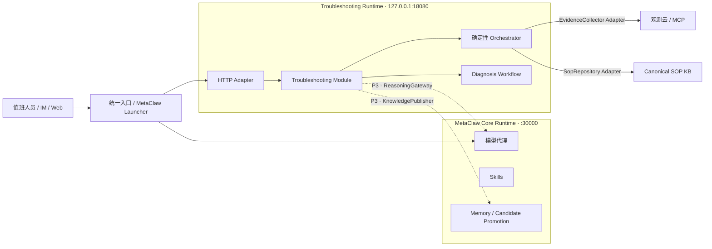

# MetaClaw × 智能排障集成设计

> 状态：Accepted · D7 · P2 可安装与可恢复已落地
>
> 日期：2026-07-23
>
> 决策：产品入口一体、代码同仓、领域 Module 分开、运行时先隔离；通过 Adapter 复用 MetaClaw，禁止继承或侵入核心内核。

## 1. 要解决的问题

当前仓库已经同时包含 `metaclaw` 与 `metaclaw_troubleshooting` 两个 Python 包，也提供
`metaclaw`、`metaclaw-troubleshooting` 两个命令。但这只是“同仓、同发行包”，还不是可安全交付的产品集成：

- MetaClaw 核心运行时负责模型代理、Skills、Memory、Skill Evolver 与训练调度；
- 排障运行时负责故障上下文、确定性路由、证据采集、诊断状态机、人工审批、关闭与知识候选；
- P2 前排障工作台仍从仓库 `docs/` 读取；现已迁入包内 static，并随 wheel 安装；
- 两个 FastAPI 应用都有根路由和 `/healthz`，不能直接无前缀合并；
- MetaClaw 默认可监听 `0.0.0.0`，而排障接口尚未接 RBAC/SSO，直接挂载会扩大暴露面；
- 真实 DQL/MCP 是远程 I/O，不能阻塞 MetaClaw 聊天代理的事件循环与故障域。

因此，目标不是“把排障代码搬进 `metaclaw/`”，而是建立一个产品级组合根，让两个深 Module 在清晰的
Seam 上协作。

## 2. D7 决策

### 2.1 保留的形态

- `metaclaw`：元学习与模型代理核心 Module。
- `metaclaw_troubleshooting`：智能排障领域 Module。
- 同一仓库、同一版本、同一安装包、同一 `metaclaw` 生命周期命令。
- 初期使用两个进程；排障默认只监听 `127.0.0.1`。
- 用户入口可以统一，但统一入口不等于同一进程。

### 2.2 禁止的形态

- 不让 `TroubleshootingOrchestrator` 继承 `MetaClawAPIServer`。
- 不让排障领域代码导入 `metaclaw.api_server`、`MemoryManager` 等内部实现。
- 不把 Case、Run、Evidence、Approval 等领域模型塞进 MetaClaw 核心模型。
- 不在未接身份认证前，把 `/workbench` 暴露到 MetaClaw 的公网监听地址。
- 不因统一启动而自动连接生产写执行器；写操作仍只记录批准与外部结果。

## 3. 目标拓扑



依赖方向只有两条：

1. MetaClaw Launcher 只负责监督排障进程，不读取排障领域模型；
2. 排障 Adapter 只依赖 MetaClaw 的稳定 HTTP 契约，不导入 MetaClaw 内部实现。

这样可以独立发布修复、独立压测和独立降级，也避免循环依赖。

## 4. 排障 Module 的外部 Interface

调用者不应直接组合 `TroubleshootingOrchestrator`、`DiagnosisWorkflow` 与 Repository。P1 已收敛成一个
深 Module；HTTP 的业务命令只通过以下 Interface：

```python
class TroubleshootingModule(Protocol):
    def diagnose(
        self,
        incident: IncidentContext,
        *,
        actor: str | None = None,
        rehearsal: bool = False,
    ) -> Diagnosis: ...

    def apply(
        self,
        diagnosis_id: str,
        command: DiagnosisCommand,
    ) -> Diagnosis: ...

    def get(self, diagnosis_id: str) -> Diagnosis | None: ...

    def list(self, *, include_rehearsals: bool = False) -> list[Diagnosis]: ...
```

P1 为保持现有 API 行为，命令中的 `actor` 仍来自请求体，只能视为审计标签，**不是可信身份**。因此在 P5
接入 SSO / Gateway Identity Adapter 前，`metaclaw-troubleshooting` 启动命令硬拒绝非 loopback 地址，不得把
当前 Interface 暴露为公共入口。

### 已落地的 Interface 不变量

- `diagnose` 按 `(system,error_code,service,5分钟桶)` 幂等；重复输入返回既有 Case/Run。
- `apply` 承载 confirm、transfer、approve、record_outcome、close 等命令；并发命令在 Repository 原子更新中串行提交。
- 状态迁移冲突返回稳定机器码与可读 `detail`，客户端不依赖错误文案分支。
- 任何路径都不直接执行生产写操作。
- MetaClaw 不可用时，确定性路由仍可工作；未知码必须 abstain，不得伪造恢复动作。
- Evidence 不完整或 SOP 未审核时 fail-closed。
- HTTP、IM 与 Web 只消费统一 `Diagnosis`，不各自拼接业务状态。

### P5 入口准入不变量

- `actor` 必须来自已验证身份，禁止继续相信请求体中的任意字符串。
- `get/list/apply` 必须执行组织空间与能力授权；未认证 401、无能力 403。
- 在这两项完成前，只允许 `127.0.0.1` 本地入口，不得宣称已完成统一公共入口。

## 5. Seam 与 Adapter 准入

当前只保留已经有真实调用方和替换实现方向的 Seam：

| Seam / Interface | 当前 Adapter | 下一 Adapter | 失败语义 |
|---|---|---|---|
| `DiagnosisRepository` | `SQLiteDiagnosisRepository`（`InMemory` 仅用于测试） | Postgres / 共享事务存储 | 存储不可用时拒绝创建/迁移状态，不静默丢审计 |
| `SopRepository` | `InMemorySopRepository` | `CanonicalSopRepository` / SOP MCP | 冲突、损坏、未审核均不进入正式诊断 |
| `EvidenceCollector` | `FixtureEvidenceCollector` | `GuanceMcpEvidenceCollector` | 超时转 missing evidence，强制降级人工取证 |

以下是已命名但尚未创建空 Protocol 的规划边界：

| 规划边界 | 引入触发条件 | 失败语义 |
|---|---|---|
| `ReasoningGateway` | P3 同时具备禁用/fixture 与 `MetaClawReasoningAdapter` | MetaClaw 不可用或输出校验失败时 abstain |
| `KnowledgePublisher` | P2 outbox 已持久化且 P3 有 `MetaClawKnowledgeAdapter` 消费者 | 发布失败进入 outbox 重试，关闭结果不丢失、不直接晋升 SOP |
| `IdentityProvider` | P5 同时具备本地开发身份与 SSO / Gateway Adapter | 未认证 401、无能力 403，领域层不接受伪造 actor |

只有确实存在至少两个 Adapter 或一个稳定外部调用边界时才创建 Seam。不要为未来猜测创建空 Protocol。

## 6. MetaClaw 复用映射

| 排障需要 | MetaClaw 提供 | 集成方式 | 不允许 |
|---|---|---|---|
| 未知异常抽取、证据关联、结论表达 | 模型代理 + Skills + Memory | `MetaClawReasoningAdapter` 调稳定兼容接口 | 直接 import `api_server.py` 或绕过结构化校验 |
| 排障方法论 | Skills | 使用排障 scope 注入方法 Skill | 把结构化 SOP 全量塞进 prompt |
| 复盘与长期上下文 | Memory | 关闭后发布有证据的知识候选 | 把 Memory 当 Case/Run 主库 |
| 候选晋升 | candidate→promotion | `MetaClawKnowledgeAdapter` 发布候选及引用 | 关闭即自动覆盖 approved SOP |
| 工具调用 | 不由 MetaClaw 核心直接执行 | Orchestrator 经 MCP Adapter 调用 | 凭证进入模型上下文 |

MetaClaw 是能力底座；排障 Module 对诊断正确性、状态机和安全闸门负最终责任。

## 7. 配置合同

建议在 MetaClaw 配置中增加以下可选块，默认关闭：

```yaml
troubleshooting:
  enabled: false
  host: 127.0.0.1
  port: 18080
  public_path: /troubleshooting

  storage:
    adapter: sqlite
    url: ~/.metaclaw/troubleshooting.db

  reasoning:
    adapter: metaclaw
    base_url: http://127.0.0.1:30000/v1
    api_key_env: METACLAW_API_KEY
    timeout_seconds: 20

  evidence:
    adapter: fixture
    mcp_server: ""
    timeout_seconds: 5

  sop:
    adapter: fixture
    source: ""

  auth:
    mode: local_dev
```

约束：

- 密钥只保存环境变量名或 secret 引用，不把真实凭证写入 YAML、SOP、日志或 prompt。
- `fixture` 必须在页面、健康状态和响应中显式标记。
- 非 `local_dev` 模式禁止使用请求体 actor；必须由网关注入已验证身份。
- `enabled=false` 时，MetaClaw 核心的依赖、启动时间和行为保持不变。

## 8. 生命周期与统一入口

### 8.1 第一阶段：统一命令，分进程

`metaclaw start` 在 `troubleshooting.enabled=true` 时启动并监督排障子进程：

1. 启动 MetaClaw Core；
2. 等待 Core `/healthz`；
3. 启动排障运行时；
4. 等待排障 `/healthz` 与 `/readyz`；
5. 输出两个本地入口及运行模式；
6. `metaclaw stop` 按相反顺序停止并清理 PID。

排障进程启动失败不能把已可用的 MetaClaw 核心误报为完全不可用，但总体状态必须显示
`core=ready, troubleshooting=failed`，不能静默忽略。

### 8.2 第二阶段：统一域名，仍分进程

RBAC、持久化和静态资源打包完成后，再由可信网关映射：

- `/v1/*` → MetaClaw Core；
- `/troubleshooting/*` → Troubleshooting Runtime；
- 网关统一认证、请求 ID、限流和审计上下文。

不推荐直接把排障 Router 无前缀塞进 `MetaClawAPIServer._build_app()`。

## 9. 数据归属

| 数据 | 归属 Module | 说明 |
|---|---|---|
| Conversation、Skill、MemoryUnit、Promotion | MetaClaw | 学习与上下文资产 |
| Incident、Diagnosis、Case/Run、Evidence | Troubleshooting | 诊断事实与运行态 |
| Approval、Outcome、Closure、AuditEvent | Troubleshooting | 安全、恢复验证与审计主记录 |
| KnowledgeCandidate 发布状态 | Troubleshooting | 负责 outbox、重试与去重 |
| 已接收的 Memory / Promotion 记录 | MetaClaw | 不反向充当排障事务库 |
| 原始日志、指标、链路、工单 | 外部系统 | 排障只保存必要快照、引用与摘要 |

跨 Module 使用稳定 ID 和版本化 JSON 合同，不共享数据库表，也不跨库 join。

## 10. 安全与运行准入

在满足下列条件前，排障运行时必须保持 loopback：

- RBAC/SSO 已接入，至少有 `view`、`diagnose`、`confirm`、`transfer`、`approve`、`close`、`admin` 能力；
- Actor 从身份上下文生成，审批原因、操作者和时间不可由客户端覆盖；
- Case/Run/Evidence/Audit 已持久化，关键迁移具备事务性；
- 工作台已移入 `metaclaw_troubleshooting/static/` 并加入 package-data，wheel 安装后可访问；
- 真实 Evidence Adapter 有超时、并发限制、断路和脱敏；
- MetaClaw LLM 输出经过 schema 校验、证据引用校验、置信度与 abstain 闸门；
- 生产写执行器继续保持断开，直到另立决策。

## 11. 降级矩阵

| 故障 | 系统行为 | 用户可见结果 |
|---|---|---|
| MetaClaw Core 不可用 | 已命中 SOP 的确定性路径继续；未知码 abstain | “智能兜底不可用，转人工深查” |
| 观测云 / MCP 超时 | Evidence 标记 missing，不返回 500，不输出正式根因 | 人工取证步骤与失败来源 |
| SOP 键冲突或未审核 | fail-closed，只允许影子取证 | 草案/冲突警告，不展示恢复动作 |
| Knowledge 发布失败 | 关闭事务完成，候选进入 outbox 重试 | “已关闭，知识候选待同步” |
| 排障存储不可用 | 拒绝新建和状态迁移 | 503 + 可追踪错误 ID |
| 排障进程不可用 | MetaClaw Core 保持服务 | Launcher/status 明确显示局部失败 |

## 12. 分阶段实施

### P1 · Module 收口，不改变现有行为（核心收口已完成 · 2026-07-23）

> D7-P1 修订记录：原 P1 同时要求预建 `ReasoningGateway` / `KnowledgePublisher`，并让全部测试穿过
> Module。实施时确认这与本设计“没有真实 Adapter 就不建空 Seam”冲突。现正式修订为：P1 只抽取已有
> 两侧调用者的 `DiagnosisRepository`；Reasoning / Knowledge Protocol 在 P2/P3 具备 outbox 与真实 Adapter
> 后再创建。Orchestrator 算法测试、HTTP 契约测试继续在各自边界，另增 Module 行为测试。此修订不降低
> fail-closed、人工闸门或不连接生产写执行器的验收标准。

- 新增 `TroubleshootingModule` façade；HTTP Adapter 不再直接拼 Orchestrator、Workflow、Store。
- 抽出已有真实持久化边界的 `DiagnosisRepository`；幂等、副本隔离与原子命令更新由 Repository 负责。
- 新增 6 项 Module Interface 行为测试；Orchestrator 算法测试与 HTTP 契约测试仍保留在各自边界。
- `ReasoningGateway`、`KnowledgePublisher` 延后到真实 Adapter/outbox 出现时再创建，避免空抽象。
- 保持 `metaclaw-troubleshooting` 独立命令可运行。

验收结果：26 项排障测试通过；现有演练行为不变；MetaClaw 未启动时，确定性 fixture 流程仍可完整运行；
官方启动命令拒绝 `0.0.0.0` 等非 loopback 绑定。
身份认证属于 P5 入口准入，当前请求体 `actor` 未验证，故 P1 完成不代表可开放网络入口。

### P2 · 可安装与可恢复（已完成 · 2026-07-23）

- 工作台迁入包内 `static/`，工作台和 SQL migration 均配置为 package-data；`docs/` 页面只保留跳转入口。
- 新增 `SQLiteDiagnosisRepository` 与 schema migration v2。当前先把 Diagnosis 作为一个聚合 JSON 持久化，
  原子保存 Case/Run、Evidence、Approval、Transfer、Outcome、Closure、AuditEvent 与 KnowledgeCandidate，避免在
  查询模式尚未稳定时过早拆成多张领域表。
- 知识候选与关闭聚合在同一 SQLite 事务提交；Outbox 以 `candidate_id` 唯一，提供租约 claim、显式 ack、
  失败记录与可重试语义。P2 只定义可靠交付合同，不耦合 MetaClaw Memory，也不假装已经存在 Publisher。
- 新增 `/readyz`、capabilities 与运行模式展示；503 响应携带可在服务日志中检索的错误 ID，工作台保留该 ID。
- FastAPI 中会访问同步 SQLite 的路由交给线程池执行，轻量 `/healthz` 保持事件循环可响应；迁移失败会关闭
  已部分创建的连接并 fail-closed。

验收结果：38 项排障测试通过（另含 7 个 subtests），Ruff 与 mypy 通过；从 wheel 安装后可启动并加载
`static/` 与 v1/v2 migrations；完整主流程关闭后重启，Case/Run/审批/转派/关闭记录精确恢复；Outbox 已实测
claim → failed → 重启 → retry → ack，尝试次数、错误信息与最终清空状态均持久化。

### P3 · MetaClaw 能力接入

- 在双侧 Adapter 已存在时引入 `ReasoningGateway` 与 `KnowledgePublisher` Protocol。
- 实现 `MetaClawReasoningAdapter`，仅处理未知码/低完整度输入。
- 实现 `MetaClawKnowledgeAdapter`，关闭后异步消费 outbox 中的候选。
- 增加 schema、引用、置信度、abstain 和超时测试。

验收：MetaClaw 停机不会破坏确定性路径；未知码不会因模型故障产生恢复动作。

### P4 · 真实数据面

- 实现 Guance MCP Evidence Adapter 与 canonical SOP Repository。
- 处理 106 个知识质量阻断项，先打穿 `903001`。
- 建立 20–30 条历史回归集与影子流量。

验收：真实 DQL 字段、阈值、延迟和降级完成内网核实；仍无生产写执行。

### P5 · 统一入口

- Launcher 增加可选子进程监督与联合状态。
- 接可信网关、RBAC/SSO、限流和审计上下文。
- 用户从 MetaClaw 产品入口进入 `/troubleshooting`。

验收：外部入口只有统一认证后的路径；核心代理与排障数据面可独立扩缩、独立故障。

## 13. Definition of Done

只有同时满足以下条件，才可称为“继承到 MetaClaw 产品内”：

- 用户通过 MetaClaw 的统一启动与入口使用排障；
- MetaClaw Core 不包含排障领域模型和状态机；
- 排障通过 Adapter 复用 MetaClaw reasoning 与 knowledge 能力；
- 确定性路径在 MetaClaw 不可用时仍安全降级；
- 安装包包含工作台，数据可恢复，身份可信，审计可追踪；
- 真实 Evidence 与 canonical SOP 通过各自 Adapter 接入；
- 生产写执行器仍由独立决策控制。
